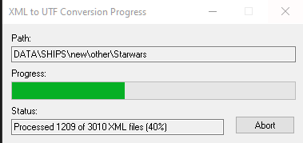
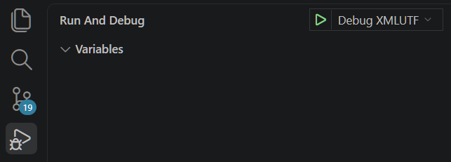

✨Dvurechensky✨

<h1 align="center">🐟 XML to UTF Конвертер 🐟</h1>

    
    
    

    

  <strong>🌐 Язык: </strong>
  
  
    ✅ 🇷🇺 Русский (текущий)
  
  | 
  <a href="./README.md" style="color: #0891b2; margin: 0 10px;">
    🇺🇸 English
  </a>

---

> [!NOTE]
> Этот проект является частью экосистемы **Lizerium** и относится к следующему проекту:
>
> - [`Lizerium.Tools.Structs`](https://github.com/Lizerium/Lizerium.Tools.Structs)
>
> Если вы ищете связанные инженерные и вспомогательные инструменты — начните оттуда.

---

## Благодарности

> [!NOTE]
> Этот проект основан на работе сообщества Freelancer.  
> Переработан и интегрирован в экосистему Lizerium.
>
> Основано на работе [`Jason Hood (adoxa)`](https://adoxa.altervista.org/freelancer/index.html)
> Полный список [авторов](CREDITS.md)

---

## Моя версия

> [!TIP]
> Это **кастомная переработанная версия**, созданная под мои собственные задачи. Однако список изменений вы можете найти в [CHANGELOG](CHANGELOG.ru.md)

---

## Запуск отладочной версии

- Visual Code (Кликни на Play)

---

## Описание

`UTFXML.exe` — инструмент для упаковки:

- `.cmp`
- `.3db`
- `.mat`
- `.txm`

> [!TIP]
> [Что это такое](docs/WHAT.ru.md)

---

## Сборка

### Visual Studio 2022 && Visual Code

> Важно наличие в системе `Visual Studio 2022` и его компоненты `Developer Command Prompt for VS 2022`

1. Открыть `Visual Code` -> `Terminal`
2. [`Сборка`](build.bat)

### Visual Studio 2008

> [!IMPORTANT]
> Используется старый toolchain для максимальной совместимости.

- **IDE:** Visual Studio `2008`
- Конфигурация: `Release`

Шаги:

1. Открыть проект
2. Собрать
3. Готово

---

## Связанные направления

Этот слой связан с:

- [`Lizerium.DataValidation.Framework`](https://github.com/Lizerium/Lizerium.DataValidation.Framework)
- [`LizeriumXMLtoUTF`](https://github.com/Lizerium/LizeriumXMLtoUTF)
